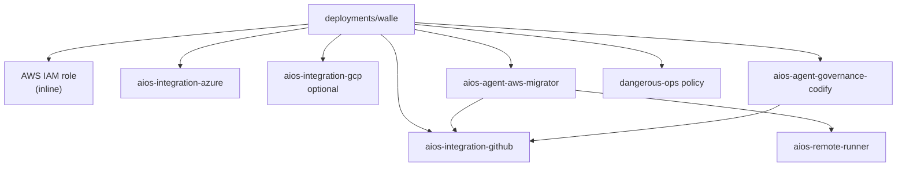

# Agent pipeline config

Terraform/OpenTofu configuration for the StackGen **AWS migrator** agent pipeline (AWS → Azure and/or GCP by workflow intent).

**Naming:** agent/workflows/runner use `aws-migrator-*`; Guild cloud integrations use `cloud-{aws,github,azure,gcp}`; mapping catalogs stay destination-scoped (`aws-to-azure` / `aws-to-gcp`). See [modules/aios-agent-aws-migrator/NAMING.md](modules/aios-agent-aws-migrator/NAMING.md). Full recreate cutover: destroy under the prior state key, re-init `tramlaw/aws-migrator.tfstate`, apply, register `aws-migrator-runner`, preload `.aws-migrator` script pack.

**Docs:** [docs hub](../docs/README.md) — architecture, workflows, LLM vs scripts, ops.

## Module dependency (typical `walle` deployment)

## Layout

- `modules/aios-agent-aws-migrator/` - reusable StackGen workflow module, runner scripts, personas, runbooks, and stage spawn contracts.
- `deployments/` - empty-workspace bring-up roots (IAM role, integrations, policy, remote runner, agent). Start here for a greenfield workspace — see [deployments/README.md](deployments/README.md).
- `examples/scenarios/aws-migrator/` - runnable Demo Workspace root that reuses existing integrations/runner/policy.
- `tfvars/` - local `*.tfvars` files (gitignored). Pass with `-var-file=../../tfvars/<name>.tfvars`.

## Included workflows

Workflow intents: `aws-cloud-discovery`, `azure-migration-pr`, `gcp-migration-pr`. Legacy name mapping: [docs/12-i-want-to.md](../docs/12-i-want-to.md).

## Not included

Local Terraform state, plan files, and `.terraform/` working directories are intentionally excluded.
