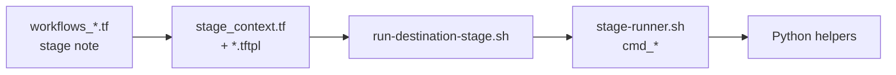

# 1. Mental model

## What this pipeline does

End-to-end, the agent workflow:

1. **Discovers** live AWS inventory with `cloud2code` and writes a monolithic `terraform.tfstate`.
2. **Splits** that state into logical groups under `aws/groups/<id>/`.
3. **Reverse-engineers** OpenTofu/Terraform HCL per group so `tofu plan` against AWS shows no drift.
4. **Maps** each group to Azure and/or GCP using deterministic mapping catalogs + generators (`azure/groups/<id>/`, `gcp/groups/<id>/`) — not freehand LLM inventing resource types.
5. **Opens GitHub PRs** for human review. The agent never runs `tofu apply` on the migrated destination roots.

## What “review-candidate” means

Destination output is good enough to **open a PR and discuss**. It is **not** “merge and apply into production tonight.”

Standards we aim for in generated HCL:

- Destination **naming + baseline security defaults** (CAF-style Azure; GCP analogues such as uniform bucket-level access / private-by-default where applicable)
- OpenTofu/HashiCorp root layout per group
- Honest **`emission`** labels (see [glossary](02-glossary.md)) so `mapped` is not mistaken for “full equivalent”

## Repo folders in one glance

```text
cloud-migrator/
  docs/                      ← you are here (human guides)
  agent-pipeline-config/     ← how we *install* the agent into StackGen
    modules/                 ← reusable OpenTofu modules
    deployments/walle/       ← greenfield workspace bring-up
    examples/scenarios/…     ← reuse existing Demo Workspace assets
  aws/                       ← PR output: reverse-engineered AWS IaC
  azure/                     ← PR output: generated Azure IaC + artifacts
  gcp/                       ← PR output: generated GCP IaC + artifacts
```

**Governance docs:** runtime conform fetches live from [Governance-and-Policy](https://github.com/Walmart-StackGen/Governance-and-Policy) on GitHub. The optional `docs/nile-governance/` folder is a human browse pin only (see [glossary](02-glossary.md)).

## Two different “Terraform” worlds (easy to confuse)

| World | Purpose |
| --- | --- |
| **Pipeline config** under `agent-pipeline-config/` | OpenTofu that creates Guild agents, workflows, secrets, runner bindings |
| **Migration IaC** under `aws/`, `azure/`, and `gcp/` | Customer cloud Terraform written by the workflow into GitHub PRs |

You `tofu apply` the **pipeline config**. You **review** (and a human later may apply) the **migration IaC**.

## Who does the heavy lifting?

| Actor | Job |
| --- | --- |
| **Guild / StackGen** | Runs the agent workflow stages in the cloud |
| **Remote runner** (`aiden-runner`) | Executes shell, `cloud2code`, `tofu`, `git`, `gh` on a machine you operate |
| **Script pack** | Versioned bash/Python on the runner (deterministic) |
| **LLM agent** | Orchestrates stages: paste the right `execute_series`, read notes, submit evidence — **does not invent AWS→destination mappings** |

Details: [LLM vs scripts](05-llm-vs-scripts.md).

## Invocation flow (4 layers)



Full stage index: [11. Script and stage catalog](11-script-and-stage-catalog.md).
