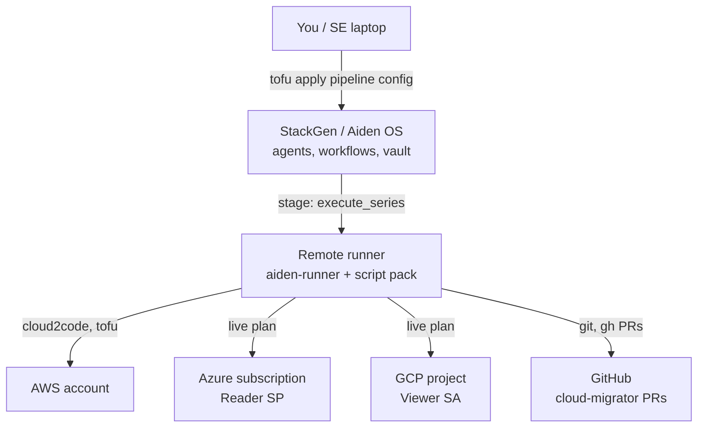

# 3. Architecture

## Big picture

## Config composition (`deployments/walmart` and `deployments/greenfield`)

Typical empty-workspace stack (order matters):

1. **Foundation** — LLM models / API keys  
2. **Policies** — shared + deployment `dangerous-ops.rego`  
3. **Integrations** — AWS, GitHub, Azure (Reader SP), optional GCP SA  
4. **Remote runner** — register runner + attach secrets (`ARM_*`, GCP ADC, pack preload)  
5. **Agent module** — `aios-agent-aws-migrator` (agents + workflows + spawn contracts; Azure and GCP destinations selected by workflow intent)

Scenario roots under `examples/scenarios/` reuse **existing** Demo Workspace integrations instead of creating new ones.

## Data flow of one migration (happy path)

1. Trigger **`aws-cloud-discovery`** with `aws_region` (or start from an existing AWS split branch for destination-only retests).
2. Runner scans AWS → writes monolith state under a workdir.
3. Split + reverse-IaC → discovery PR updating `aws/`.
4. Trigger **`azure-migration-pr`** and/or **`gcp-migration-pr`** with `source_pr` from the discovery PR.
5. Runner loads catalogs → blueprints → `azure_iac_generate.py` / `gcp_iac_generate.py` → `azure|gcp/groups/...`.
6. Validate: fmt/validate + optional **sampled** live destination plan.
7. Open sibling destination PRs updating `azure/` and/or `gcp/` + artifacts.

## Secrets (never commit)

| Secret | Where it lives | Used for |
| --- | --- | --- |
| `stackgen_token` | tfvars / env (local apply) | Provider auth |
| LLM keys | foundation vars | Agent chat |
| AWS creds | vault / runner | cloud2code + AWS tofu |
| GitHub token | vault | clone, PR, `gh` |
| `ARM_*` | runner secret | Azure Reader live plan |
| `GOOGLE_APPLICATION_CREDENTIALS_JSON` / `GCP_PROJECT_ID` | runner secret | GCP live plan |

Put values in `*.tfvars` that stay **gitignored**. Rotate any token that was pasted into chat or tickets.

## Trust boundaries

- **LLM** can call tools the agent is allowed (shell on runner, GitHub, AWS MCP). Policies + HITL gate dangerous shell.  
- **Generator Python** only reads JSON + writes files — no cloud credentials inside the script.  
- **Source AWS role** is ReadOnlyAccess minus explicit Deny for never-map identity/Athena/key-pair APIs (catalog `non_applicable`); discovery also defaults `cloud2code_exclude` for those types.  
- **Live plan** uses Reader / Viewer-style credentials — should not create/destroy destination resources.  
- **Apply migrated destination IaC** is out of scope for the agent; humans own that decision.
