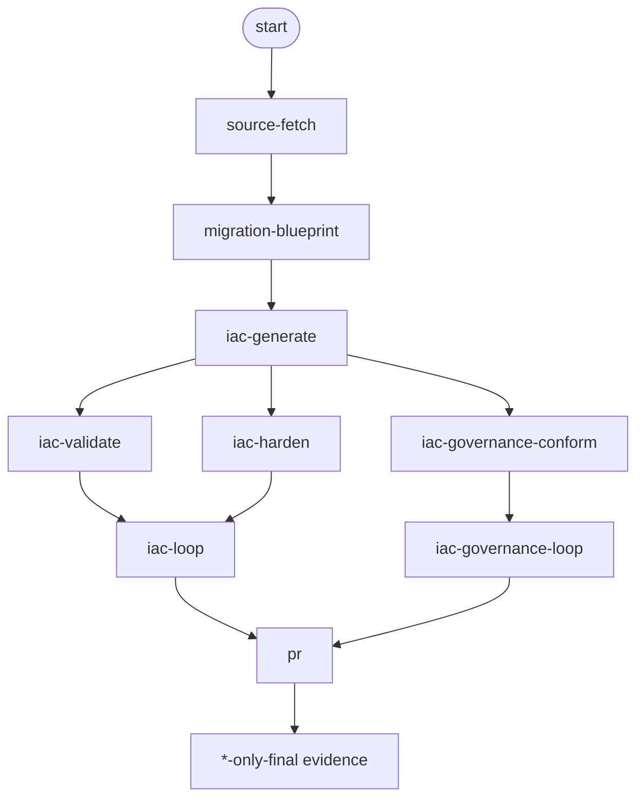
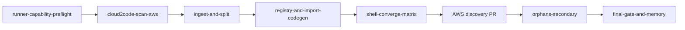
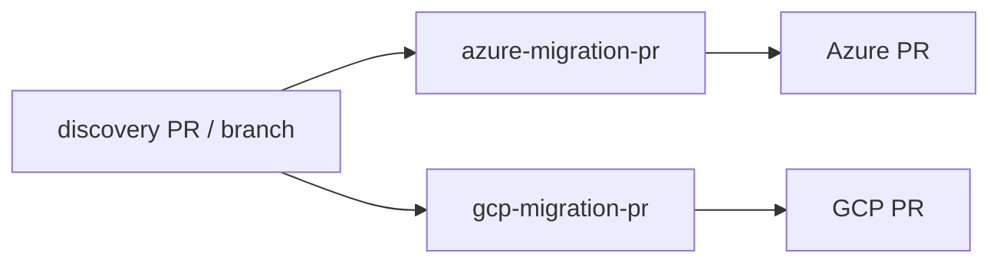

# 4. Workflows and stages

## Why living Nile governance (this PR)

Nile **Governance-and-Policy** markdown keeps changing. Destination agents must **learn on the fly** each run — not freeze Priority-1 text into Nile-Factory Python.

Each `azure-iac-governance-conform` / `gcp-iac-governance-conform` visit:

1. **Refresh** `Walmart-StackGen/Governance-and-Policy` (default `main`; fail closed `blocked:governance_docs_unavailable`).
2. **Derive** a per-resource decision tree from the current catalog, matrix, tagging standard, Priority-1 notes, PRR gates, and evidence schema.
3. **Author** `azure|gcp/artifacts/governance-validator.py` from **that** tree (drop the harness scaffold marker).
4. **Execute** against generated IaC, **fix** mechanical HCL, **re-verify**.
5. **Iterate** (bounded by `max_governance_iterations`) until every resource is Priority-1-conformant or a terminal blocker.
6. **Open the destination PR only when** `*_iac_governance_ok=true`. Artifacts pin the governance git SHA so later doc changes stay auditable.

The optional submodule `docs/nile-governance` is a **human browse / pin**, not the runtime source. Validation evidence is **not** human approval (Evidence Schema / Gate 11).

## Primary workflows

| Workflow | Purpose |
| --- | --- |
| **`aws-cloud-discovery`** | Scan AWS → split → reverse-IaC → **one AWS discovery PR** → optional orphan handoff |
| **`azure-migration-pr`** | From discovery PR/branch (`source_pr`) → generate Azure → validate / harden / living-gov conform → Azure PR |
| **`gcp-migration-pr`** | From discovery PR/branch (`source_pr`) → generate GCP → validate / harden / living-gov conform → GCP PR |
| **`governance-rules-codify`** | On-demand: Governance-and-Policy markdown → `rules/` Rego + conftest → PR → GHA `rules-validate` |

Exact resource names live in the module TF (`workflows_discovery.tf`, `workflows_azure_only.tf`, `workflows_gcp_only.tf`, `workflows_orphan.tf`, and `modules/aios-agent-governance-codify/workflows_governance_codify.tf`). Names can include a `name_prefix` from the deployment.

## Destination-only stage flow



Loops exist when generate/validate fail **or** Priority-1 residuals remain. If governance docs cannot be fetched, the run fail-closes (`blocked:governance_docs_unavailable`) and no destination PR opens.

## What each destination stage must leave behind

| Stage | Azure signals | GCP signals |
| --- | --- | --- |
| Generate | `azure_iac_generated=true`, `azure/groups/` | `gcp_iac_generated=true`, `gcp/groups/` |
| Validate | `azure_plan_status=…` | `gcp_plan_status=…` |
| Harden | `azure_iac_harden_ok=true` | `gcp_iac_harden_ok=true` |
| Governance conform | `azure_iac_governance_ok`, `azure/artifacts/governance-source.json` (SHA) | `gcp_iac_governance_ok`, `gcp/artifacts/governance-source.json` |
| PR | `azure_pr_url=…` (only if governance_ok=true) | `gcp_pr_url=…` (only if governance_ok=true) |
| Final | Azure evidence checklist (includes governance) | GCP evidence checklist (includes governance) |

Governance artifacts (per cloud, this-run): `governance-source.json`, `resource-inventory.json`, `governance-decision-tree.json`, `governance-validator.py`, `governance-findings.json`, `governance-conformance-report.json`, `governance-exceptions.md`.

## Governance rules codify (on-demand)

Separate module: `agent-pipeline-config/modules/aios-agent-governance-codify`. Trigger intent: `governance-rules-codify`.

```text
rules-intake   # dual-clone: Governance-and-Policy (read md) + Nile-Factory (manifest); note codify_inventory_json
  → rules-codify   # branch on Nile-Factory; write Rego packs from source markdown
  → rules-pr       # open PR on Nile-Factory; poll until GHA rules-validate green; rules_codify_ok=true
```

- **No remote runner** — git I/O via GitHub integration (`gh` / `git`).
- **No dangerous_ops policy** on this agent.
- **Validation** runs in **target** repo CI (`.github/workflows/rules-validate.yml` + `rules/run-tests.sh`), not inline in Guild.

**Source:** [Governance-and-Policy](https://github.com/Walmart-StackGen/Governance-and-Policy) `governance/**/*.md`

**Target:** [Nile-Factory](https://github.com/Walmart-StackGen/Nile-Factory) `rules/` tree + PR.

## Discovery high-level DAG

`aws-cloud-discovery` is AWS-only. Destination Azure/GCP PRs are **separate workflow runs** after discovery.



After the discovery PR merges or is ready for handoff, run destination workflows separately:



## Discovery stages (high level)

1. **Discover** — `cloud2code` / AWS inventory → monolith state
2. **Split** — logical groups + registry
3. **Reverse-IaC** — HCL per group; AWS plan ≈ no drift
4. **AWS PR** — push `aws/` tree on `discovery/<run_id>`
5. **Orphan handoff** — optional secondary workflow for ungrouped resources
6. **Final gate** — discovery evidence checklist (AWS proof only)

Destination Azure/GCP paths run under `azure-migration-pr` / `gcp-migration-pr` with `source_pr` or `source_iac_branch`.

## Where stages are defined

| File | Contents |
| --- | --- |
| `workflows_discovery.tf` | AWS cloud discovery only |
| `workflows_azure_only.tf` | Azure-only path |
| `workflows_gcp_only.tf` | GCP-only path |
| `workflows_orphan.tf` | Orphan / cleanup style flows |
| `modules/aios-agent-governance-codify/` | Governance markdown → `rules/` codify workflow |
| `locals_azure_stages.tf` / `locals_gcp_stages.tf` | Shared stage metadata |
| `stage_context.tf` | Runner execute-series context embedded in stage prompts |
| `templates/*.tftpl` | Embedded series scripts and prompts (SOP `nile-governance-learn-and-conform.md.tftpl` is a **method**, not a control catalog) |
| `scripts/governance_conform.py` | Harness only: refresh, inventory, seed/run whatever validator path notes point at — **no hardcoded Nile Priority-1 catalog** |

## Operator tip

When a run fails, open the Guild **execution watch** page (or export a debug ZIP) and find:

1. Which **stage** last succeeded
2. Whether the failure is **preload / credentials / catalog / living-gov fetch / LLM loop**
3. The **notes** map (often clearer than chat) — especially `*_iac_governance_ok` and `*_governance_commit_sha`

See also [day-2 ops](08-day-2-ops.md) and [reading Azure](07-reading-azure-prs.md) / [reading GCP](07b-reading-gcp-prs.md) PRs.
