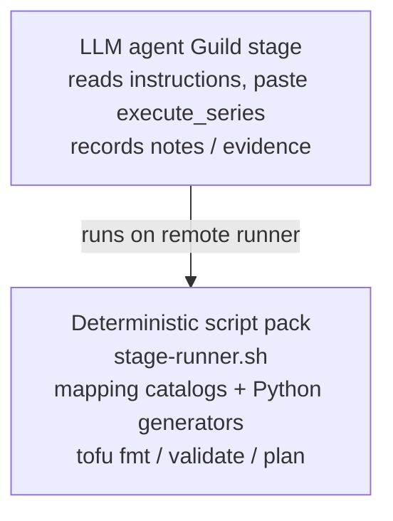

# 5. LLM vs scripts (critical)

This is the most common source of confusion when reading the pipeline.

## Short answer

| Question | Answer |
| --- | --- |
| Does the LLM invent AWS→Azure mappings? | **No.** The catalog + Python do. |
| Does the LLM write `azure_iac_generate.py` output? | **No.** The script writes HCL. |
| What is the LLM for? | **Orchestration** on most stages: paste `execute_series`, read notes, recover. **Living Nile governance** is the exception: after the harness refresh, the agent derives a this-run decision tree and authors `governance-validator.py` from current docs (not a frozen Priority-1 list in Python). |

## Picture

## Why this design?

- **Reproducibility** — same catalog + same AWS groups → same emission class  
- **Reviewability** — PRs review HCL and JSON, not “what the model felt like”  
- **Safety** — security defaults live in code (TLS, NSG deny, no password defaults), not in prompt hope  

## What *is* still LLM-sensitive?

- Stage ordering when loops fire  
- How carefully evidence notes are filled  
- Whether the agent stops vs retries forever on hard failures  
- Quality of **human-readable** PR body text (if the stage asks the model to summarize)

If Azure HCL looks wrong, **fix the catalog or generator**, not the persona prompt first.

## File map

| Artifact | Role |
| --- | --- |
| `scripts/azure_iac_generate.py` | CAF/WAF OpenTofu roots from blueprint |
| `scripts/azure_mapping_catalog.py` | Load catalog, classify emission |
| `mappings/aws-to-azure.json` | AWS type → Azure target + emission |
| `scripts/stage-runner.sh` | Bash orchestration for all stages |
| `scripts/governance_conform.py` | Harness only: refresh living docs, inventory, run whatever validator path notes point at |
| `scripts/governance_schemas/` | JSON Schema for source / inventory / tree / findings / report |
| Module templates `*.tftpl` | Series the LLM is told to paste (`nile-governance-learn-and-conform` is a **method**) |
